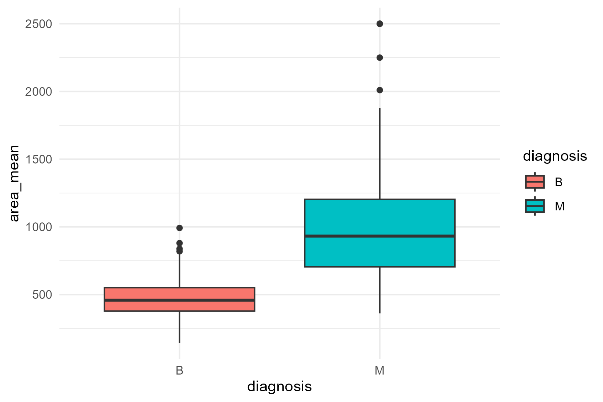
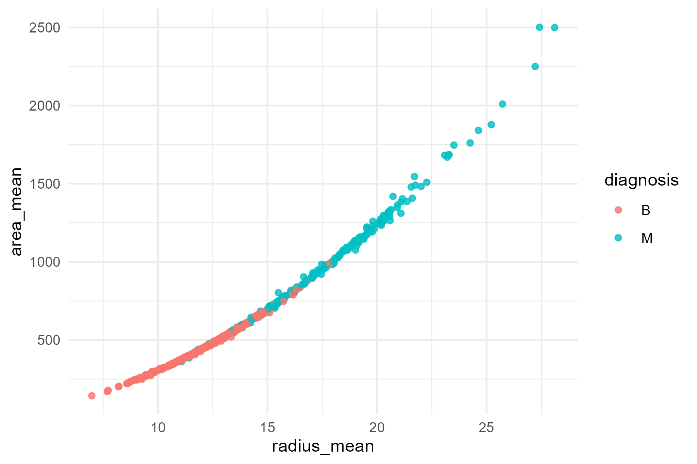
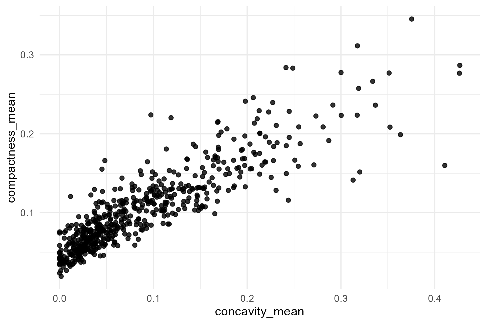
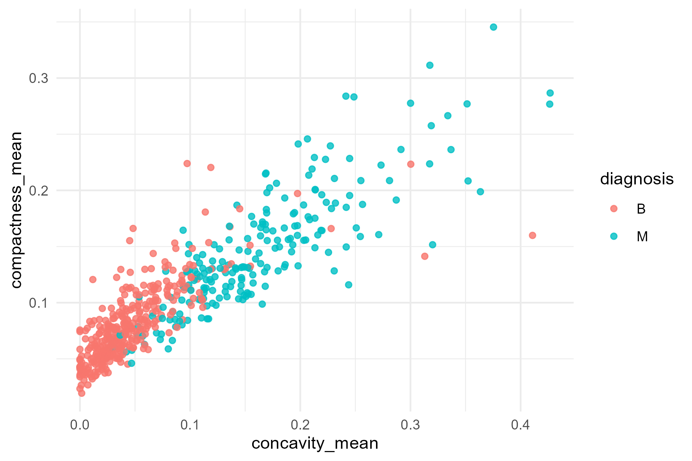

# Breast Cancer Wisconsin – EDA (R)

Exploratory Data Analysis (EDA) and statistical comparison between benign (B) and malignant (M) tumors using the Breast Cancer Wisconsin dataset.

## What was done
- Descriptive statistics (mean, sd)
- Boxplots and scatter plots
- Correlation analysis
- Welch two-sample t-test for group comparison

## Tools
- R
- tidyverse (dplyr, ggplot2, readr)

## Figures

### Area mean by diagnosis

### Radius vs Area

### Concavity vs Compactness

### Concavity vs Compactness (by diagnosis)

